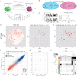
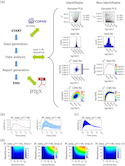
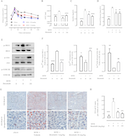
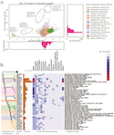
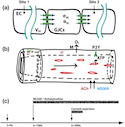
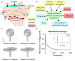

## References {.page_break_before}

<!-- Explicitly insert bibliography here -->

## Supplemental Figures

![
Topic associated tokens are highly enriched when comparing bioRxiv to the New York Times.
The plot on the left (A) is a point range plot of the odds ratio with respect to bioRxiv.
Values greater than one indicate a high association with bioRxiv whereas values less than one indicate high association with the New York Times.
The dotted line provides a breaking point between both categories.
The plot on the right (B) is a bar chart of token frequency appearing in bioRxiv and New York Times respectively.
](https://raw.githubusercontent.com/greenelab/annorxiver/8dbc3f8e248ff3e7958c3420363443f0c61b2cc1/biorxiv/corpora_comparison/output/figures/biorxiv_vs_reference.png){#fig:biorxiv_v_reference}

![
Typesetting symbols and biologically relevant tokens are highly enriched when comparing PubMed Central (PMC) to the New York Times.
The plot on the left (A) is a point range plot of the odds ratio with respect to PMC.
Values greater than one indicate a high association with PMC whereas values less than one indicate high association with the New York Times.
The dotted line provides a breaking point between both categories.
The plot on the right (B) is a bar chart of token frequency appearing in PMC and New York Times respectively.
](https://raw.githubusercontent.com/greenelab/annorxiver/8dbc3f8e248ff3e7958c3420363443f0c61b2cc1/biorxiv/corpora_comparison/output/figures/pmc_vs_reference.png){#fig:pmc_v_reference}

## Supplemental Tables

| Title [citation]     | PC_1  | License | Figure Thumbnail | Figure Link |
|--------------------------------|-------------------|------------|----------|-------------|
| Conditional Robust Calibration (CRC): a new computational Bayesian methodology for model parameters estimation and identifiability analysis [@doi:10.1101/197400] | 4.700554908074704 | None         |  | https://www.biorxiv.org/content/biorxiv/early/2017/10/02/197400/F1.large.jpg |
| Machine learning of stochastic gene network phenotypes [@doi:10.1101/825943]                                                                                      | 4.410660604449826 | CC-BY-NC-ND  |  | https://www.biorxiv.org/content/biorxiv/early/2019/10/31/825943/F5.large.jpg |
| Notions of similarity for computational biology models [@doi:10.1101/044818]                                                                                      | 4.355295926618207 | CC-BY-NC-ND  |  | https://www.biorxiv.org/content/biorxiv/early/2016/03/21/044818/F1.large.jpg |
| GpABC: a Julia package for approximate Bayesian computation with Gaussian process emulation [@doi:10.1101/769299]                                                 | 4.351517618262304 | CC-BY-NC-ND  |  | https://www.biorxiv.org/content/biorxiv/early/2019/09/18/769299/F1.large.jpg |
| SBpipe: a collection of pipelines for automating repetitive simulation and analysis tasks [@doi:10.1101/107250]                                                   | 4.321847854182741 |  CC-BY-NC-ND |   | https://www.biorxiv.org/content/biorxiv/early/2017/02/09/107250/F1.large.jpg |
| | | | | |
| Spatiotemporal proteomics uncovers cathepsin-dependent host cell death during bacterial infection [@doi:10.1101/455048]                                           | -4.263964235099807 |  CC-BY-ND   |  | https://www.biorxiv.org/content/biorxiv/early/2018/11/07/455048/F1.large.jpg |
| Systems analysis by mass cytometry identifies susceptibility of latent HIV-infected T cells to targeting of p38 and mTOR pathways [@doi:10.1101/371922]           | -4.279016673409032 | CC-BY-NC-ND |  | https://www.biorxiv.org/content/biorxiv/early/2018/07/19/371922/F1.large.jpg |
| NADPH consumption by L-cystine reduction creates a metabolic vulnerability upon glucose deprivation [@doi:10.1101/733162]                                         | -4.592209988884236 | None        |  | https://www.biorxiv.org/content/biorxiv/early/2019/08/13/733162/F1.large.jpg |
| Inhibition of Bruton’s tyrosine kinase reduces NF-kB and NLRP3 inflammasome activity preventing insulin resistance and microvascular disease [@doi:10.1101/745943] | -4.736613689905791 | None        |   | https://www.biorxiv.org/content/biorxiv/early/2019/08/28/745943/F1.large.jpg |
| AKT but not MYC promotes reactive oxygen species-mediated cell death in oxidative culture [@doi:10.1101/754572]                                                   | -4.826793742506695 | None        |   | https://www.biorxiv.org/content/biorxiv/early/2019/09/01/754572/F1.large.jpg |

Table: Top and bottom five systems biology preprints projected onto the PC1 direction. These preprints contain quantitative and molecular biology concepts respectively. {#tbl:five_pc1_table}

| Title [citation]   | PC_2  | License  | Figure Thumbnail | Figure Link |
|--------------------------------|--------------|-------------------|----------|----------|
| Pangenome Analysis of Enterobacteria Reveals Richness of Secondary Metabolite Gene Clusters and their Associated Gene Sets [@doi:10.1101/781328]                                                           | 3.5865702659438883 |  CC-BY-ND    |  | https://www.biorxiv.org/content/biorxiv/early/2019/09/25/781328/F1.large.jpg |
| QTG-Finder: a machine-learning based algorithm to prioritize causal genes of quantitative trait loci [@doi:10.1101/484204]                                                                                 | 3.470388383023157  | None         |    | https://www.biorxiv.org/content/biorxiv/early/2019/04/29/484204/F1.large.jpg |
| Identification of candidate genes underlying nodulation-specific phenotypes in Medicago truncotula through integration of genome-wide association studies and co-expression networks [@doi:10.1101/392779] | 3.3814906334073953 |  CC-BY-NC-ND |   | https://www.biorxiv.org/content/biorxiv/early/2018/08/16/392779/F1.large.jpg |
| Raw sequence to target gene prediction: An integrated inference pipeline for ChIP-seq and RNA-seq datasets [@doi:10.1101/220152]                                                                           | 3.3632576028389742 | None         |   | https://www.biorxiv.org/content/biorxiv/early/2017/11/16/220152/F3.large.jpg |
| The y-ome defines the thirty-four percent of Escherichia coli genes that lack experimental evidence of function [@doi:10.1101/328591]                                                                      | 3.28742786641417   | CC-BY        |  | https://www.biorxiv.org/content/biorxiv/early/2018/12/03/328591/F1.large.jpg |
| | | | | |
| The effects of time-varying temperature on delays in genetic networks [@doi:10.1101/019687]                                                                                                    | -2.7047102478958056 | None          |  | https://www.biorxiv.org/content/biorxiv/early/2015/09/24/019687/F1.large.jpg |
| An analog to digital converter creates nuclear localization pulses in yeast calcium signaling [@doi:10.1101/357939]                                                                            | -2.775745000260895  | None          |  | https://www.biorxiv.org/content/biorxiv/early/2018/06/28/357939/F1.large.jpg |
| Nicotinic modulation of hierarchal inhibitory control over prefrontal cortex resting state dynamics: modeling of genetic modification and schizophreniarelated pathology [@doi:10.1101/301051] | -3.047342382798414  | None          |  | https://www.biorxiv.org/content/biorxiv/early/2018/04/13/301051/F1.large.jpg |
| Electrical propagation of vasodilatory signals in capillary networks [@doi:10.1101/840280]                                                                                                     | -3.107715578793087  |  CC-BY-NC-ND  |  | https://www.biorxiv.org/content/biorxiv/early/2019/11/13/840280/F1.large.jpg |
| Dendritic spine geometry and spine apparatus organization govern the spatiotemporal dynamics of calcium [@doi:10.1101/386367]                                                                  | -3.21533499072831   |  CC-BY-NC-ND  |  | https://www.biorxiv.org/content/biorxiv/early/2019/05/29/386367/F1.large.jpg |

Table: Top and bottom five systems biology preprints projected onto the PC2 direction. These preprints contain bioinformatis and neuroscience concepts respectively. {#tbl:five_pc2_table}

